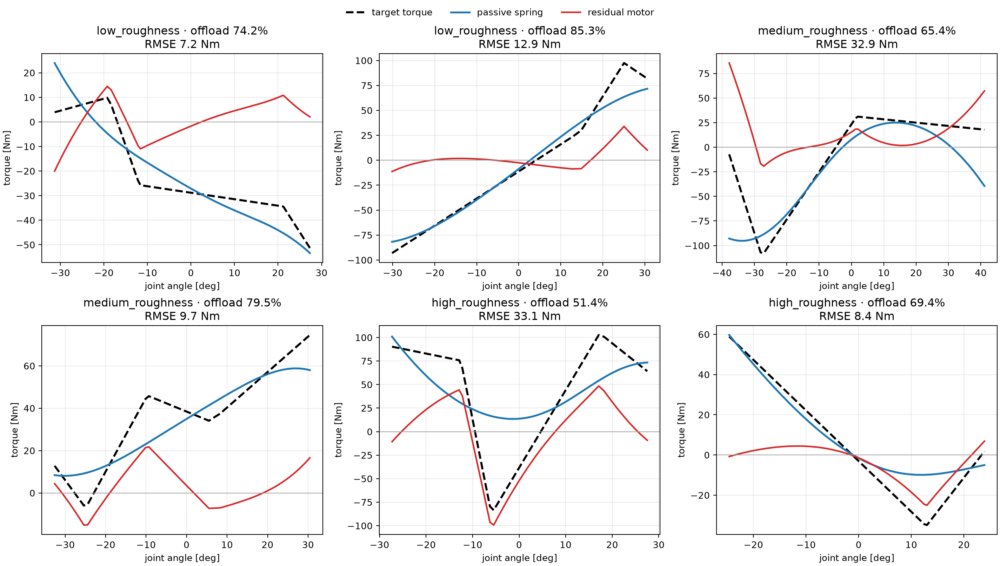
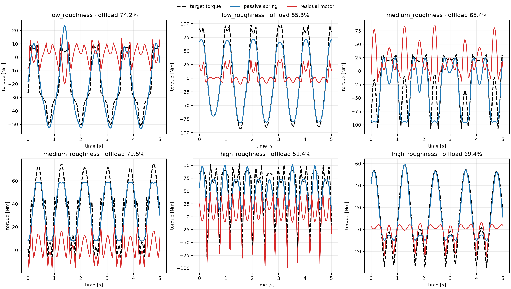
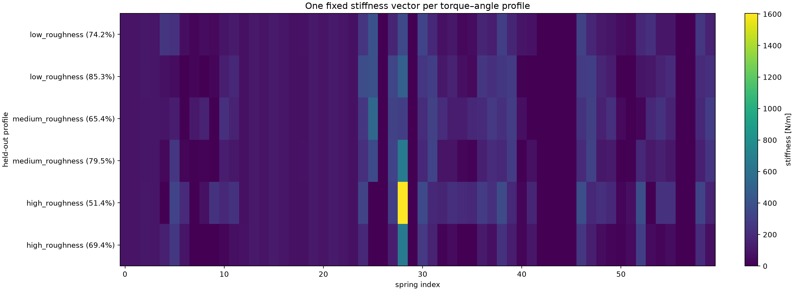

# Adaptive Spring Network

The active research implementation is in [`spring-network/`](spring-network/README.md).

The active causal period-adaptive trainer runs the first period at the topology's
default stiffness, buffers that complete period's motion and realized torques,
then updates the 3D network's 60 stiffnesses once at the boundary. The selected
stiffness vector is held unchanged for the entire following period. Run it with:

```powershell
python spring-network/04_adaptive_learning/train_period_adaptive_3d.py
```

The run automatically saves training convergence, torque-versus-time,
torque-versus-angle, and period-level stiffness-schedule figures under
`spring-network/plots/period_adaptive_3d/`, plus an exact-mechanics summary CSV.

The former profile-conditioned passive trainer selects one spring-stiffness vector
from the complete five-knot torque-angle profile and holds it fixed throughout
execution:

```powershell
python spring-network\04_adaptive_learning\train_profile_conditioned_passive.py `
  --profiles-per-family 2000 `
  --test-profiles-per-family 400 `
  --samples 160 `
  --iterations 10000 `
  --energy-weight 30 `
  --min-stiffness 0 `
  --unbounded-stiffness `
  --output-name profile_conditioned_passive
```

This controller is reconfigurable between supplied profiles but passive within
each profile. The former timestep-adaptive pipeline is preserved under
`spring-network/archive/timestep_adaptation/` and is no longer active.

For the genuine 3D mechanics path, train one passive stiffness vector per
profile on the spatial 60-spring topology with:

```powershell
conda run -n adaptive-spring-network python run_full_refresh.py
```

The correction phases predict one fixed stiffness vector with the MLP,
re-relax all 6,000 training profiles at all 160 samples using that vector,
rebuild the local spring-torque basis from 960,000 relaxed states, and
fine-tune the same MLP. Positive `--mechanics-correction-profiles` or
`--mechanics-correction-samples` values are explicit debug-only subset limits;
their default of zero means the complete dataset.

## Linear 3D passive-spring results

The following figures use exact 300-step relaxed spatial mechanics for the
held-out profiles of the learned 60-spring linear model:






Research project with The University of Bristol
